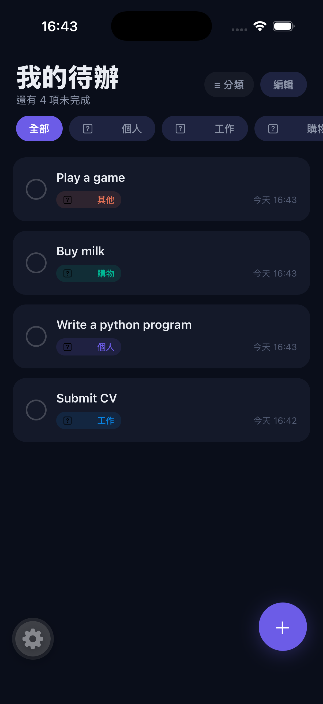
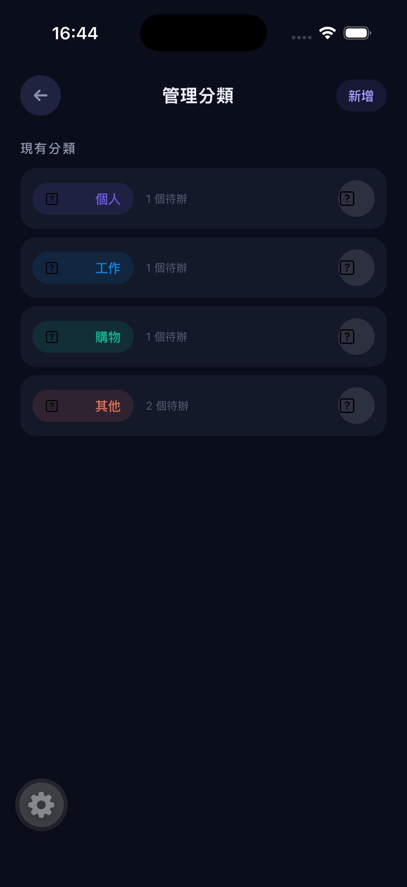
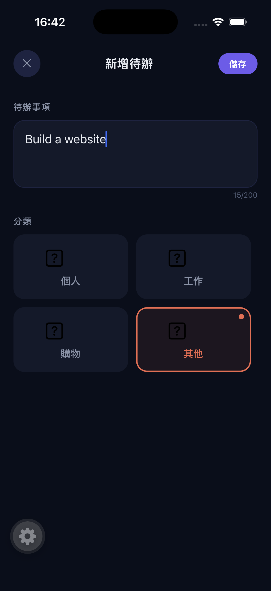
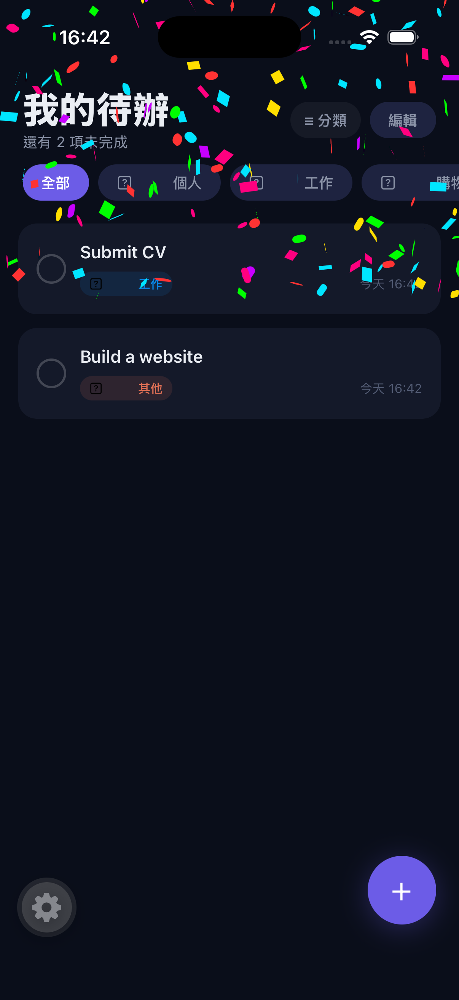

# 📝 To-Do Project (待辦事項工具)

[English Version](#english-version) | [中文版本](#中文版本)

> 一個注重細節與使用者情緒價值的高質感 React Native (Expo) 待辦事項應用程式。

<div align="center">
  
</div>

---

## 🇹🇼 中文版本

這是一個以流暢手勢與豐富動畫回饋為主的跨平台 To-Do 應用。我們不只關注幫助你紀錄代辦，更希望能讓你在點擊「完成」的那一刻，實質地感受到成就感與情緒價值。

### ✨ 核心功能
* 🗂 **自訂分類與 Emoji 圖示**：不局限於內建圖庫，新增分類時，您可直接透過手機內建鍵盤自由選取任何 Emoji 作為專屬分類圖示。
* 👆 **流暢的雙模式手勢操作**：
  * **瀏覽模式**：支援全螢幕左右滑動快速切換分類，卡片式呈現。
  * **編輯模式**：支援長按拖曳排序（Drag & Drop），操作最直覺。
* 🎉 **全螢幕慶祝動畫**：完成待辦事項時，螢幕底部會發射出 150 顆繽紛的全螢幕彩帶碎紙花，給您滿滿的成就感回饋！
* 📺 **電視關機刪除特效**：在刪除項目時，卡片會像是傳統映像管電視關機般瞬間壓扁成線，接著流暢地橫向收合消失，刪除手感十分俐落。
* 💾 **本機安全儲存**：目前階段採用 `AsyncStorage` 進行資料的純本機儲存，極快且不需網路連線。

### 📸 畫面預覽
*(請將您的實際應用程式畫面截圖存放到 `./assets` 資料夾中並替換以下圖片連結)*

| 📱 首頁佈局與分類 | ✍️ 新增/編輯待辦 | 🎉 全螢幕慶祝動畫 |
| :---: | :---: | :---: |
|  |  |  |

### 🚀 安裝與執行
本專案使用 Expo 開發，您需要先準備好 Node.js 與 npm 環境。

1. **安裝相依套件**：
   ```bash
   npm install
   ```
2. **如果你使用的是 iOS 模擬器 (Mac環境)**：
   若需重新建立原生目錄（可選）：
   ```bash
   cd ios && pod install && cd ..
   ```
3. **啟動 Expo 開發伺服器**：
   ```bash
   npx expo start
   ```
4. 開啟在您的實體設備或是模擬器上運行測試！

### 🛠 使用技術疊層
* **框架**: React Native, Expo Router
* **動畫與手勢**: `react-native-reanimated`, `react-native-gesture-handler`
* **特效組件**: `react-native-confetti-cannon`
* **資料儲存**: `@react-native-async-storage/async-storage`
* **列表拖放**: `react-native-draggable-flatlist`

---

## 🇺🇸 English Version

> A high-quality React Native (Expo) To-Do application focusing on details, smooth gestures, and delivering emotional value to its users.

This is a cross-platform To-Do app centered around fluid gestures and rich animated feedback. We want you to feel a real sense of accomplishment the moment you check off a task.

### ✨ Core Features
* 🗂 **Custom Categories with Emojis**: When creating a new category, use your phone's native keyboard to select any Emoji as a custom category icon.
* 👆 **Fluid Dual-Mode Gestures**:
  * **Browse Mode**: Swipe left/right on the screen to switch between categories in a card-style layout.
  * **Edit Mode**: Long-press to drag, drop, and reorder tasks seamlessly.
* 🎉 **Full-Screen Celebration Animations**: Checking off a task triggers a massive explosion of 150 colorful confetti pieces from the bottom of the screen to give you a strong emotional reward!
* 📺 **TV Shut-Off Delete Effect**: Deleting a task squishes the card vertically into a thin line and collapses it horizontally, mimicking a satisfying retro CRT TV turning off.
* 💾 **Secure Local Storage**: Data is saved instantly and securely to your device offline using `AsyncStorage`.

### 📸 Screenshots
*(Please save your actual app screenshots to the `./assets` folder and replace the image links below)*

| 📱 Home Layout | ✍️ Add/Edit Task | 🎉 Celebration Effect |
| :---: | :---: | :---: |
|  |  |  |

### 🚀 Installation & Running
This project is built using Expo. Ensure you have Node.js and npm installed.

1. **Install Dependencies**:
   ```bash
   npm install
   ```
2. **If you are targeting iOS via simulator**:
   ```bash
   cd ios && pod install && cd ..
   ```
3. **Start Expo Development Server**:
   ```bash
   npx expo start
   ```
4. Open the app on your physical device or simulator!

### 🛠 Tech Stack 
* **Framework**: React Native, Expo Router
* **Animations/Gestures**: `react-native-reanimated`, `react-native-gesture-handler`
* **Visual Effects**: `react-native-confetti-cannon`
* **Storage**: `@react-native-async-storage/async-storage`
* **Drag-and-Drop Lists**: `react-native-draggable-flatlist`
